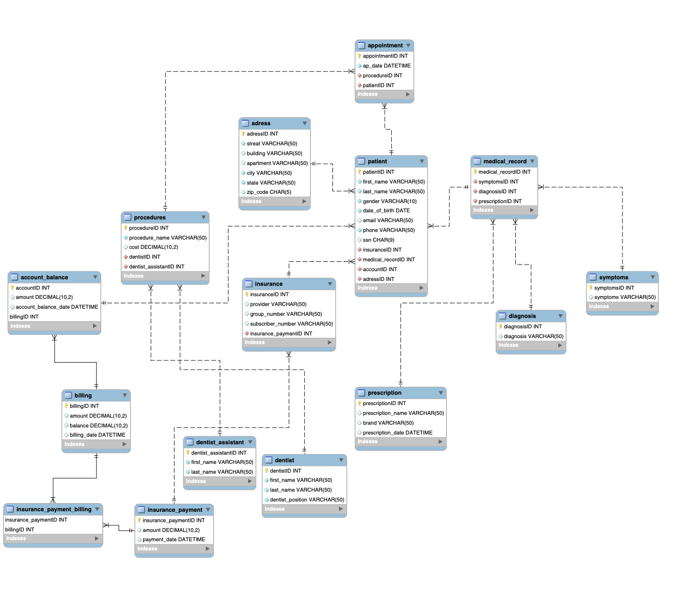

# Dental Clinic Database for an Electronic Medical Record System

For this project I decided to develop a Dental Clinic database system that forms a basic entity of the management of the clinic. It is important for the system to be functional, reliable, and user friendly. 
My Dental Clinic database supports EMR system that allows a user to enter information:
-	patient demographic information: first and last name, gender, date of birth, email, phone, social security number, address, insurance
-	medical record (symptoms, diagnosis, and prescription)
-	account balance (amount, date, billing, insurance payment)
-	appointment information (appointment date, procedure, cost, patient, dentist)
-	dentist information (first name, last name, position)

To secure the database I added user authentication so only authorized users have access to the database. To limit the functions that a user can perform I added a role-based access control to my database. For example, I added a reception user who can select any tables and look for any data in the database. However, a reception user only allowed to insert and update address table, patient information, and appointment information. A dentist user allowed to make changes (insert and update) only for prescription table, diagnosis, symptoms, and procedures. An accounting user allowed only to update and insert information into accounting balance table, billing, and insurance payment. For my EMR system only developer has a full access to the database. 
The database should be functional and easy to use so an authorized user based on his role could easily get access to the data without errors.
For example:
-	a user should be able to add a new diagnosis
-	a user should be able to update balance information
-	a user should be able to update, insert, and delete appointment information
-	a user should be able to get information about account balance level (low, medium, high) 
-	a user should be able to get information about balance amount
-	a user should be able to check if social security number already exists

Steps to develop a Dental Clinic database system:
The first step was defining fields that are important for the Dental Clinic database system. On this step it was important to identify entities and attributes of the database, understand entity relationship of the database, identify primary and foreign keys, and try to make sure that tables will satisfy the Boyce-Codd Normal Form.
The next step was to create Entity Relationship Diagram with appropriate data type, primary keys, foreign keys, and make sure all tables satisfy the Boyce-Codd Normal Form.
After the ER diagram was created I developed all neccessary SQL scripts to support the database:
- created a schema and then tables to implement the database design. Every table has indexes
- created new SQL scripts to insert values into tables so the database will be complete
- created couple test scripts to make sure that the database is working correctly. For example, an authorized user can change billing date; can get appointment information: patient first name, last name, appointment date, and procedure; can check patient medical history: patient name, symptoms, diagnosis, prescription; can check patient information: first name, last name, gender, date of birth, email, social security number, address (street, building, apartment, city, state, zip-code), medical history (symptoms, diagnosis, prescription), insurance pr provider, subscriber number, group number), account balance (amount, date); can find patients who have one appointment and appointment information. 
- created an application programming interface using stored procedures
- created stored procedures which allow to add a new row for tables. Also, I used transactions in nested stored procedures. Each stored procedure runs insert statements as a transaction. Using stored procedures as transactions allow to prevent database errors. 
- To make it easier for a user to use the database and do not write joins every time when a user needs to get an information, I created couple views which allow to get a full information of frequently used tables. For example, I created the views of medical record of patient which gives a full information of prescription, symptoms, and diagnosis. To get an information of procedure and dentist I created one more view which shows procedure name and cost, and dentist who is assigned to that procedure. One more view shows an information about appointment: date of appointment, procedure, patient name.
- To demonstrate functionality of the database I created stored functions: the stored function returns account balance level on amount (low if account balance is lower than $500, medium if account balance more than $500 but less than $1000, high if account balance is more than $1000); calculates total balance amount from the billing table (amount + billing); checks if social security number already exists in the patient table.
- To enable audit trail, I created triggers for each table so every change in the database is monitored. Every time when a record is accessed (inserted, updated, deleted) action type, action date, and a user is recorded
- created transactions with save points and roll back so every time any field of a record is inserted, updated, or deleted the previous value of the record is saved. 

